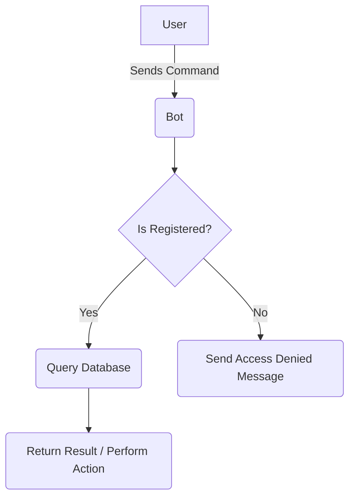

# ENP Course Bot

A Telegram bot designed to help ENP students store, retrieve, and share academic materials efficiently.
Built using Python, PostgreSQL, and `python-telegram-bot`.

---

## Features

- `/upload` --Upload multiple academic materials (admin only)
- `/get` --Retrieve files contained in a module/type
- `/search` --Search files by name or keyword
- `/delete` --Delete files (admin only)
- `/register`--Register using your email (rquired before usage)

---

## How it works?

---
## Access Control

- Registered users can :
  - get files
  - search files
  - list directories
- Admins can:
  - upload new files
  - delete files
  - check registered list

## Tech Stack

## Demo Preview

### Start:

## Contact
- **Bot:**
[@ENPcoursebot](https://t.me/ENPcoursebot)
- **email**:
[course_bot](enpcourse.bot@gmail.com)

